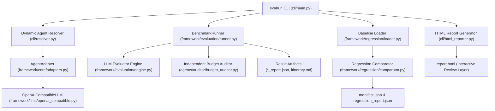
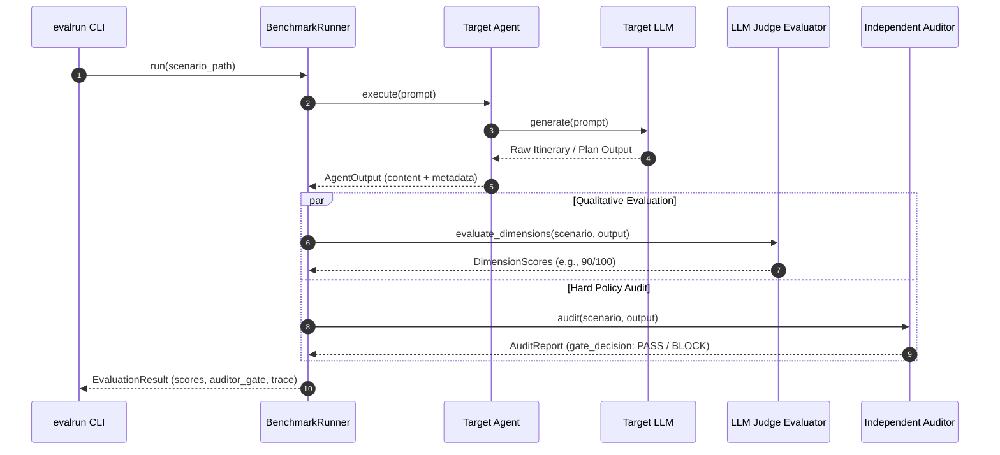
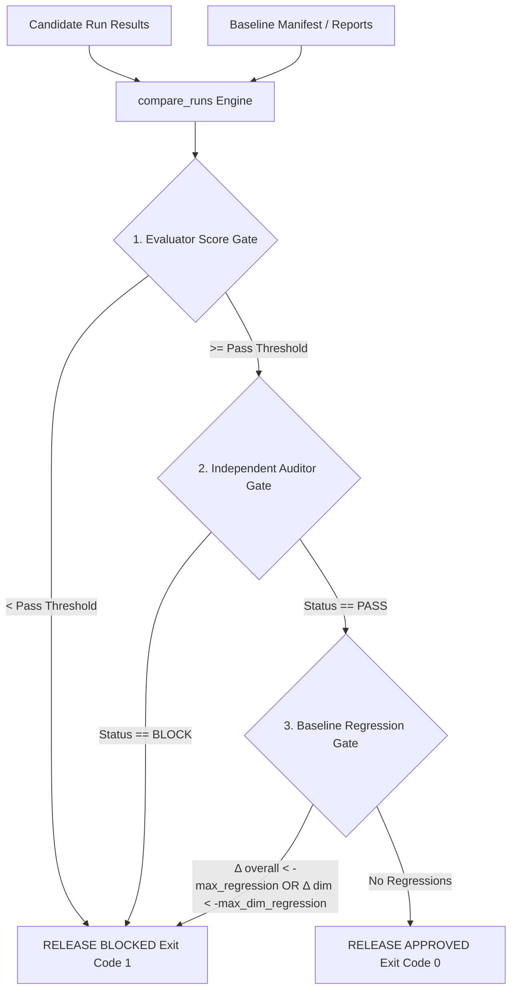

# Platform Architecture & Data-Flow Documentation

## Executive Overview

The **Agent Evaluation Platform** provides reproducible evaluation, independent release gatekeeping, generic model adaptation, and automated baseline regression testing for LLM agents.

Key Architectural Principle: **Quality score $\neq$ Release decision.**

While LLM evaluators produce qualitative dimension scores (e.g. 85/100), the **Independent Budget Auditor** enforces strict mathematical, financial, and policy conditions (e.g. unbudgeted luggage lockers, transport omissions, or currency hallucinations) that override qualitative scores and block releases.

---

## 1. System Component Overview

---

## 2. Evaluation Pipeline & Dual-Pass Auditor Flow

---

## 3. Baseline Comparison & 3-Tier Release Gate Engine

---

## 4. Key Subsystem Responsibilities

1. **`cli/`**:
   - `main.py`: Command-line controller handling argument parsing, run execution, baseline regression invocation, exit code determination (`0`, `1`, `2`).
   - `resolver.py`: Dynamic import and instantiation of Python classes (`module:Class`) or factory functions (`module:factory`).
   - `formatter.py`: Plain-text ASCII terminal summary table formatting and secret redaction.
   - `html_reporter.py`: Self-contained interactive HTML evaluation report with jump bar, search/filter, visual score bars, and baseline deltas.

2. **`framework/core/` & `framework/llms/`**:
   - `adapters.py`: Domain-neutral `AgentAdapter` wrappers (`PythonAgentAdapter`, `HttpAgentAdapter`, `CliAgentAdapter`).
   - `openai_compatible.py`: `OpenAICompatibleLLM` adapter supporting hosted endpoints (OpenAI, NVIDIA NIM, Gemini) and local endpoints (vLLM, Ollama, LM Studio) with exponential backoff retries on transient 5xx/429 errors.

3. **`framework/regression/`**:
   - `loader.py`: Baseline manifest and per-scenario report loader supporting directory paths or isolated manifest files.
   - `comparator.py`: Per-scenario and per-dimension score delta ($\Delta \text{score}$) calculation, missing baseline scenario blocking, and 3-tier release gate evaluation.

4. **`agents/auditor/`**:
   - Deterministic claims extraction and MCP constraint verification enforcing hard financial and policy rules.
