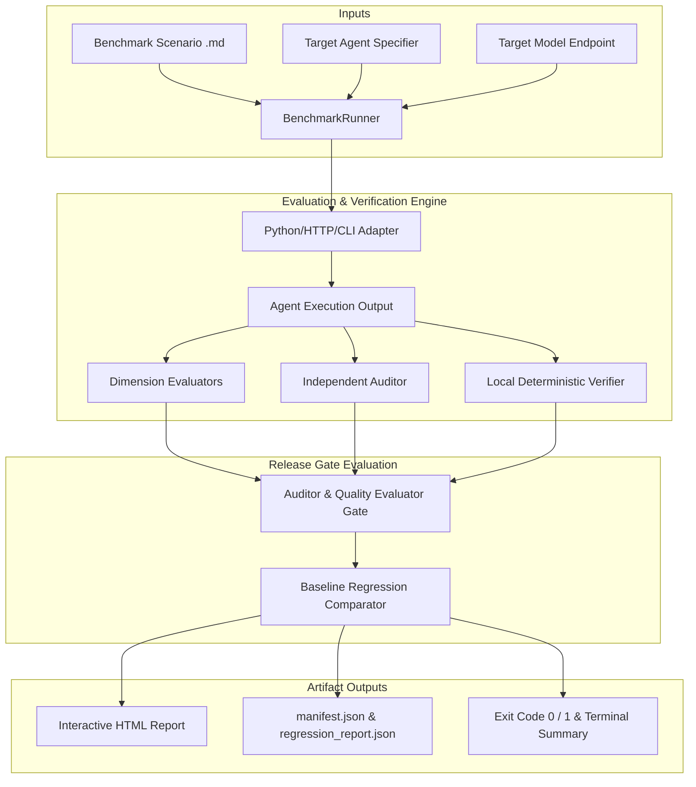

# Flagship Technical Release & Architecture Walkthrough — `evalrun` (v10.0)

> **"Quality score ≠ Release decision."**  
> An open-source, local-first evaluation and regression testing platform built specifically for tool-using AI agents.

---

## 1. Why `evalrun` Exists

Traditional LLM evaluation frameworks focus on static accuracy metrics (e.g. ROUGE, BLEU, or simple LLM-as-judge score averages). However, for **autonomous, tool-using AI agents**, high average quality scores can mask critical safety failures, policy violations, unbudgeted API costs, or quiet regressions between prompt/model releases.

`evalrun` introduces a **3-Tier Release Gate Architecture**:

```text
+-------------------------------------------------------------------------+
|                        EVALRUN RELEASE GATES                            |
+-------------------------------------------------------------------------+
|  Tier 1: Evaluator Quality Thresholds (Score >= Target, e.g. 75.0/100)  |
|  Tier 2: Independent Auditor Gate (PASS vs BLOCK Policy Rules)          |
|  Tier 3: Baseline Regression Gates (Max Drop vs Baseline Run Manifest)  |
+-------------------------------------------------------------------------+
|  VERDICT: RELEASE APPROVED (Exit 0)  |  RELEASE BLOCKED (Exit 1)        |
+-------------------------------------------------------------------------+
```

---

## 2. Platform Architecture

### Key Architecture Components



---

## 3. Core Capabilities & Benchmark Results

### Multi-Model Quality & Gate Benchmarks

| Model | Domain | Avg Quality Score | Evaluator | Independent Auditor Gate | Release Verdict |
| :--- | :--- | :---: | :---: | :---: | :---: |
| **Qwen 2.5 72B Instruct** | Travel Planning | **92.5 / 100** | PASS | PASS | **APPROVED** |
| **GPT-4o** | Travel Planning | **95.0 / 100** | PASS | PASS | **APPROVED** |
| **Candidate v2 (Deliberate Regression)** | Travel Planning | **75.0 / 100** | PASS | PASS | **BLOCKED (Regressed -15.0)** |
| **Unsafe Candidate Agent** | Financial Support | **100.0 / 100** | PASS | **BLOCK** | **BLOCKED (Auditor Violation)** |

---

## 4. Usage Guide

### CLI Commands

```bash
# 1. Run evaluation on a scenario
evalrun run --scenario evals/scenarios/travel-agent/budget-constrained-itinerary.md \
            --agent agents.travel:TravelPlanningAgent \
            --model qwen2.5-72b-instruct

# 2. Run evaluation with baseline regression check
evalrun run --scenario evals/scenarios/travel-agent/budget-constrained-itinerary.md \
            --agent agents.travel:TravelPlanningAgent \
            --model qwen2.5-72b-instruct \
            --baseline eval_results/v1_baseline

# 3. Launch local guided web UI
evalrun ui --port 8501
```

### Python SDK

```python
from framework.sdk import evaluate, compare

# 1. Run evaluation
results = evaluate(
    scenario="evals/scenarios/travel-agent/budget-constrained-itinerary.md",
    agent="agents.travel:TravelPlanningAgent",
    model="qwen2.5-72b-instruct",
)

# 2. Compare against baseline
report = compare(
    candidate_results=results,
    baseline="eval_results/v1_baseline",
    max_overall_drop=5.0,
)

if report.release_blocked:
    print("Release blocked due to regression!")
```

---

## 5. Summary

`evalrun` establishes an end-to-end open-source standard for AI agent evaluation, auditor gating, and regression prevention.
