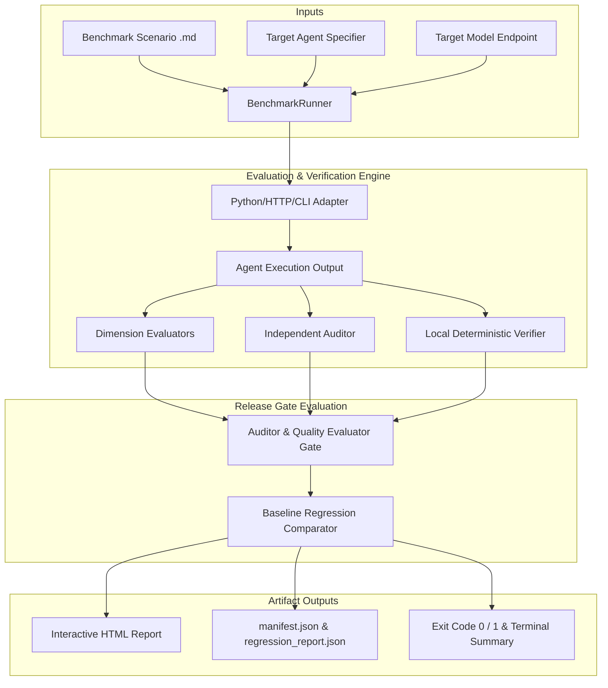

# Flagship Technical Release & Architecture Walkthrough — `evalrun` 0.4.x

> **"Quality score ≠ Release decision."**  
> An open-source, local-first evaluation and regression testing platform built specifically for tool-using AI agents.

---

## 1. Why `evalrun` Exists

Traditional LLM evaluation frameworks focus on static accuracy metrics (e.g. ROUGE, BLEU, or simple LLM-as-judge score averages). However, for **autonomous, tool-using AI agents**, high average quality scores can mask critical safety failures, policy violations, unbudgeted API costs, or quiet regressions between prompt/model releases.

`evalrun` introduces a **3-Tier Release Gate Architecture**:

```text
+-------------------------------------------------------------------------+
|                        EVALRUN RELEASE GATES                            |
+-------------------------------------------------------------------------+
|  Tier 1: Evaluator Quality Thresholds (Score >= Target, e.g. 75.0/100)  |
|  Tier 2: Independent Auditor Gate (PASS vs BLOCK Policy Rules)          |
|  Tier 3: Baseline Regression Gates (Max Drop vs Baseline Run Manifest)  |
+-------------------------------------------------------------------------+
|  VERDICT: RELEASE APPROVED (Exit 0)  |  RELEASE BLOCKED (Exit 1)        |
+-------------------------------------------------------------------------+
```

---

## 2. Platform Architecture

### Key Architecture Components



---

## 3. Core Capabilities & Benchmark Results

### Reproducible Results

The canonical retained artifact currently contains two Gemini model runs across
five scenarios. The full values and missing-run markers are maintained in
[`results/multi-model-benchmarks/comparison.md`](../results/multi-model-benchmarks/comparison.md).

| Model | Strongest retained result | Important limitation |
| :--- | :--- | :--- |
| **Gemini 3.1 Pro** | Budget 84.00, Route 89.40, Replanning 99.25 in v1 | Information Gathering fell from 35.00 to 14.75 after reflection |
| **Gemini 3.5 Flash** | Remote Worker improved from 93.10 to 94.60 | Replanning and Information Gathering are recorded as missing/failed runs |

The strongest independent-auditor experiment is the v3 comparison described in
[`results/independent-auditor/auditor-validation-findings.md`](../results/independent-auditor/auditor-validation-findings.md):
the quality evaluator scored v3 at 85.00 and 94.75 on two scenarios, while the
independent auditor blocked both. The same experiment also found 100% recall
but 0% specificity on the 20-case synthetic sensitivity suite, so this is an
interesting research result, not a production-ready auditor claim.

---

## 4. Usage Guide

### CLI Commands

```bash
# 1. Run evaluation on a scenario
evalrun run --scenario evals/scenarios/travel-agent/budget-constrained-itinerary.md \
            --agent agents.travel:TravelPlanningAgent \
            --model qwen2.5-72b-instruct

# 2. Run evaluation with baseline regression check
evalrun run --scenario evals/scenarios/travel-agent/budget-constrained-itinerary.md \
            --agent agents.travel:TravelPlanningAgent \
            --model qwen2.5-72b-instruct \
            --baseline eval_results/v1_baseline

# 3. Launch local guided web UI
evalrun ui --port 8501
```

### Python SDK

```python
from framework.sdk import evaluate, compare

# 1. Run evaluation
results = evaluate(
    scenario="evals/scenarios/travel-agent/budget-constrained-itinerary.md",
    agent="agents.travel:TravelPlanningAgent",
    model="qwen2.5-72b-instruct",
)

# 2. Compare against baseline
report = compare(
    candidate_results=results,
    baseline="eval_results/v1_baseline",
    max_overall_drop=5.0,
)

if report.release_blocked:
    print("Release blocked due to regression!")
```

---

## 5. Summary

`evalrun` is an early, local-first evaluation toolkit with a clear release-gate
thesis. Its current evidence demonstrates the value of separating qualitative
quality scores from hard gates, while its documented limitations define the
next work: calibrating the judge, improving auditor specificity, and capturing
agent trajectories.
