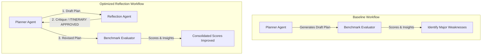

# Baseline Evaluation Findings & Reflection Analysis

## Executive Summary
This evaluation investigated early multi-agent travel planning architectures across core capabilities:
* **Session Memory** (isolated storage of preferences, constraints, state, and bookings).
* **Research Agent** & **Research Planner** (external search and planning integrations).
* **Reflection Agent** (auditing draft itineraries for constraint violations).
* **Closed-Loop Planning** (automatic multi-turn revision cycles).

To evaluate these capabilities, five benchmark scenarios were executed using the `meta/llama-3.1-8b-instruct` model. The benchmark suite successfully revealed three major weaknesses:
1. **Remote worker scheduling conflicts** (meetings scheduled during transit/sightseeing due to timezone differences).
2. **Mid-trip replanning cascades** (excessive rewriting of unaffected travel days and locked bookings).
3. **Reflection over-editing/nitpicking** (lack of a clear itinerary approval threshold).

These findings directly guided our quality optimization cycle, leading to strict stopping criteria and dynamic constraint-preservation rules.

---

## Evaluation Workflow Comparison

---

## Benchmark Summary

The following scores represent the initial baseline runs for the Planner-Only (`v1`) and the first closed-loop Planner + Reflection (`v2`) agent configurations using the `meta/llama-3.1-8b-instruct` model:

| Scenario | Planner Only (v1) | Planner + Reflection (v2) | Status | Primary Focus Dimension |
| :--- | :---: | :---: | :---: | :---: |
| **Budget** | 67.05 | 76.35 | Pass | Constraint Satisfaction / Budgeting |
| **Route Optimization** | 83.60 | 82.85 | Pass | Planning Quality / back-tracking |
| **Remote Worker** | 21.45 | 35.85 | Fail | Constraint Satisfaction (Time Zones) |
| **Replanning** | 83.95 | 73.45 | Fail | Adaptability (Day Preservation) |
| **Information Gathering** | 80.70 | 79.50 | Pass | Personalization & Search Quality |

---

## Weakness 1 — Remote Worker Timezone & Meeting Slots

### Benchmark Scenario
`travel-remote-worker-timezones`

### Symptoms
* Agent scheduled leisure sightseeing, local travel, or train transits directly during the user's mandatory remote work core meeting slots.
* Timezone conversion between the company's home base (EST/EDT) and the travel destinations (Seoul/Tokyo) was inconsistently calculated or completely ignored, leading to core-hour meeting blocks overlapping with sleeping or transit periods.
* Sightseeing activities were scheduled without leaving any buffer before or after meeting windows.

### Root Cause
The planner focused on arranging traditional travel activities sequentially without treating the user's remote work availability intervals and calendar slots as strict, immutable constraint blocks during initial plan generation.

### Impact
**High.** 
Violating meeting slots or working core windows results in severe planning failure, rendering the itinerary unusable and disruptive for working professionals.

### Planned Architectural Fix
* Refine the `ReflectionAgent` system prompt to perform a strict checklist verification of calendar overlap blocks and timezone conversion.
* Adjust the revision prompt to enforce the absolute immutability of core remote work hours.

---

## Weakness 2 — Mid-Trip Replanning Cascades & Adaptation

### Benchmark Scenario
`travel-mid-trip-replanning`

### Symptoms
* Replanning revisions initiated by the reflection loop modified days in the travel schedule that were completely unaffected by the mid-trip disruption (e.g. changing Day 18 onwards when a typhoon occurred on Day 12).
* Locked, non-refundable bookings (such as booked hotels and flights) were rearranged or removed.
* Revisions introduced excessive changes, violating the core adaptability requirement of localized impact control.

### Root Cause
The planner's revision prompt gave the LLM too much creative freedom to regenerate the entire itinerary from scratch rather than enforcing localized patch revisions.

### Impact
**High.**
A replanning agent must localize adjustments to minimize disruption. Altering unaffected days or invalidating pre-paid, non-refundable hotels is unacceptable.

### Planned Architectural Fix
* Update the revision instructions to strictly forbid rewriting or shifting days unaffected by the critique.
* Declare pre-existing locked bookings as immutable anchors that must not be modified or rearranged.
* Restrict changes to the absolute minimum necessary to resolve the disruption constraints.

---

## Weakness 3 — Route Optimization Critique Nitpicking

### Benchmark Scenario
`travel-route-optimization`

### Symptoms
* The closed-loop reflection run slightly degraded the Route Optimization score compared to the Planner-only baseline (dropping from `83.60` to `82.85`).
* The reflection agent requested minor changes or café swaps in a plan that had already satisfied the geographic routing constraints.
* Revisions triggered unnecessary edits, leading to minor planning quality regressions.

### Root Cause
The `ReflectionAgent` lacked a strict stopping threshold, behaving as if it was required to find issues, leading to cosmetic critiques instead of approving high-quality plans.

### Impact
**Medium.**
Unnecessary revision cycles increase API token usage and latency, while occasionally introducing errors into a previously correct plan.

### Planned Architectural Fix
* Add a strict instruction to the reflection system prompt: if an itinerary satisfies all hard constraints, budget limits, must-visit locations, and timezone windows, it must bypass critiques and return `ITINERARY APPROVED`.
* Forbid critiques on stylistic or cosmetic preferences (e.g., swapping cafes or rewording descriptions).

---

## Weakness 4 — Information Gathering Stylistic Redundancies

### Benchmark Scenario
`travel-information-gathering-uncertainty`

### Symptoms
* The reflection agent triggered revision cycles for information-gathering responses that had already successfully deferred the plan and asked the relevant questions.
* Critiques targeted stylistic differences rather than actual failures in deferred planning or question relevance.

### Root Cause
The reflection criteria did not differentiate between a final day-by-day travel plan and a preliminary query deferral response.

### Impact
**Low.**
Increased latency and API overhead without yielding material improvements to the query output.

### Planned Architectural Fix
* Align the reflection auditor to bypass reviews for stylistic preferences, ensuring it only flags failures to gather crucial information or structural query errors.

---

## Key Insights
* **Eval Scenarios Prove Their Value**: The evaluation suite successfully highlighted subtle structural errors (such as timezone mismatches and cascading changes to locked bookings) that were not easily catchable via manual, ad-hoc testing.
* **The Cost of Critique Freedom**: Without strict boundaries, a reflection loop behaves like an over-critical editor, suggesting cosmetic revisions that introduce planning regressions. Stricter boundaries are needed.
* **Separation of Context**: Optimizations must separate *from-scratch planning* (where global re-sequencing of days is preferred to optimize routing) from *mid-trip replanning* (where localized day preservation is paramount).
